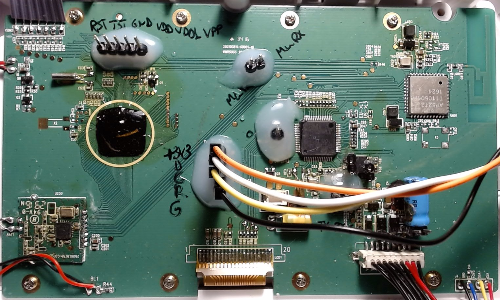
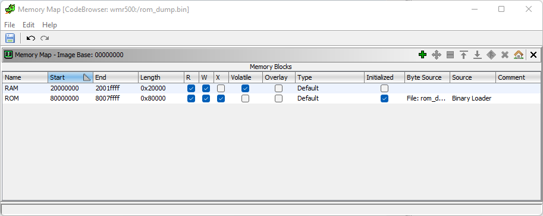

# What?
HomeAssistant integration of a Oregon Scientific WMR500C WiFi-enabled weather station.
 
# Why?
By design, the weather station works as a standalone unit, while it also supports relaying the measurements to a cloud server, which in turn interacts with the official [Android](https://play.google.com/store/apps/details?id=com.idthk.wmr500_v) or [iOS](https://apps.apple.com/us/app/smart-living-wmr500/id1332998208) applications.  
Hardware-wise, the device has no other usable external interfaces, besides the charge-only USB port and the WiFi interface.  

Ever since the middle of 2021, the cloud services are no longer available, thus rendering the smartphone apps useless. Fortunately, part of these services can be masqueraded to allow local sampling of measurement values.  
No (official) documentation regarding (third-party) integration is available - the information contained in this repo is based on reverse-engineering efforts.  

# How?
Since reverse-engineering software may pose a infringement on copyrights, it is full responsibility of the user whether to reproduce the results or not.  

In the following steps, the main unit will be referenced as `WMR500`, or just `device`.  

## 1. Define the cloud services replacements
Since the integration relies on non-standard libraries, a [Home Assistant Docker installation](https://www.home-assistant.io/installation/linux#install-home-assistant-container) is assumed to be already working.  
Also, a MQTT broker (for example Mosquitto) is also [installed](https://mosquitto.org/download), [configured](https://mosquitto.org/man/mosquitto-conf-5.html) and [accessible in HA](https://www.home-assistant.io/docs/mqtt/broker).  

The WMR500's main base relies on at least two cloud services, a HTTPS server [`app.idtlive.com`](https://app.idtlive.com) and a MQTT broker [`mqtt.idtlive.com`](mqtt://mqtt.idtlive.com:1883).  
Since neither are available anymore, new ones need to be deployed locally, and WMR500's traffic to be redirected to them instead.  

For traffic routing, a local static DNS entry is required - one method that doesn't depend on more advanced network routers is to:
- Install a DNS server on a user server, configuring it to assign DNS translation to local IP addresses,  
- Configure the network router's DHCP server's advertised secondary DNS server to the user server IP address.  

As a example, a RaspberryPi4B+ running HomeAssistant, and assigned a IP address of 192.168.0.2, connected to a router with LAN address 192.168.0.1:  
- Install on the RaspberryPi a DNS server using: `sudo apt install dnsmasq`.  
- Configure the DNS server by adding the following lines to `/etc/dnsmasq.conf`:
		```
		address=/app.idtlive.com/192.168.0.2
		address=/mqtt.idtlive.com/192.168.0.2
		```
- Optionally, to further improve network performance, add the following lines (only if the RaspberryPi is connected via wired Ethernet):
		```
		no-hosts
		no-resolv
		no-poll
		interface=eth0
		no-dhcp-interface=eth0
		```
- Reboot the RaspberryPi.  
- On the main router set the secondary DNS server address to 192.168.0.2 - if necessary set the primary DNS server entry to the router's LAN IP address (for eg. 192.168.0.1).  
- All local devices that rely on DHCP IP address assignments will now have the two DNS server addresses advertised to, 192.168.0.2 (which will resolve only `app.idtlive.com` and `mqtt.idtlive.com`) and 192.168.0.1 (which will resolve all other DNS queries).  

## 2. Configure the device
- (Optional) Reset the WMR500 to factory settings by holding both the `up` and `down` buttons on the unit for 6 seconds.  
- (Optional) Pair all external compatible sensors, by holding the `Pair` button, selecting option (2) using the `down` button, then pressing `pair`.  
- Generate the Wifi configuration string using the script [`wifi_auth_gen.py`](scripts/wifi_auth_gen.py) - replace the `WIFI_SSID` and `WIFI_PASSWD` values inside the file with own WiFi credentials.  
The config string has the structure `WMR500C(xxAAAAA,yyBBBBB)`, where `AAAAA` is the SSID, `xx` the number of characters in the SSID (excluding whitespaces), `BBBBB` the password, and `yy` the number of chars in the password, for example: `WMR500C(04SSID,08PASSWORD)`.
- Enter WiFi pairing by holding the `Pair` button, then pressing `Pair` again.  
- Connect any computer to the `OS_WMR500C_****` WiFi access point using WPA2 password `12345678`.  
- Using a Telnet client, such as [Putty](https://www.chiark.greenend.org.uk/~sgtatham/putty/latest.html) or [MobaXterm](https://mobaxterm.mobatek.net/download-home-edition.html), connect to the server `192.168.10.1:50007`.  
- After sending the authentication string previously generated, the WMR500 responds with a ID and model name - take note of the first 36-chars value (GUUID, and also MQTT client ID), as it will be used in the next steps.  
- Send the string `CONFIRM` to finalize the WiFi setup.  
- To allow the WMR500 to connect to the local MQTT server, its MQTT client password needs to be obtained - as it's using the unsecured MQTT protocol, it can easily be sniffed out using [Wireshark's](https://www.wireshark.org) TShark [command line](https://www.wireshark.org/docs/man-pages/tshark.html) utility, when run on the replacement server defined in the [previous chapter](#user-content-1-define-the-cloud-services-replacements).
- Install the tool using `sudo apt install tshark`, then run it via `sudo tshark -i eth0 -f "tcp port 1883" -Y 'mqtt.passwd' -V` to begin capturing all MQTT connect packets - modify the target network interface based on actual local server setup (for example `eth0` for wired network, or `wlan0` for wireless).  
- Trigger a full WiFi reconnection (cold-boot) by removing the batteries and USB power for at least 10 seconds, then replacing them.  
- After around a minute, the packet analysis of a MQTT connection attempt should be displayed in the console - take note of the `Client ID` (same as GUUID) and `Password` values on the last lines.  
Note - If no MQTT connect packets are received, check that the local MQTT broker is running and its authentication method is configured with a [password file or the `allow_anonymous` option](https://mosquitto.org/documentation/authentication-methods/) - use a desktop [MQTT client](http://mqtt-explorer.com/) to verify if connection with the set user/password credentials is possible.  
- Add the extracted authentication credentials to the MQTT broker's allowed users list.  
- Confirm the WMR500 is connected by running the command: `netstat -ntp | grep ESTABLISHED.*mosquitto` (only if using a Mosquitto MQTT broker).  
Note - If the command doesn't return any value, a restart of WMR500 and/or local server may be required.  
- Once the WMR500 is successfully connected to both WiFi and a local MQTT server, commands can be issued by any MQTT client that publishes to the `enno/out/json/_GUUID_` topic, where `_GUUID_` is the 36-chars GUUID previously obtained.  
- The WMR500 reacts to commands by publishing its responses on the `enno/in/json` topic.  
- A number of non-volatile parameters can be set on the main unit, using the payload `{"command": "setSettings", "XX": "YY", "id": "DEBUG"}`, where `XX` is the parameter name, and `YY` the new value.  
Known parameters are:  
	- `ca1`= temperature unit (integer): 0=°F, 1=°C.  
	- `ca2`= wind speed unit (integer): 0=m/s, 1=Knoten, 2=km/h, 3=mph.  
	- `ca3`= rainfall unit (integer): 0=mm, 1=inch.  
	- `ca4`= pressure unit (integer): 0=mbar, 1=hPa, 2=mmHg, 3=inHg.  
	- `ca5`= PM unit (integer): undefined.  
	- `ca6`= altitude (integer): meters.  
	- `cb1`= time zone (integer): undefined.  
	- `cb2`= time format (integer): 0=12H, 1=24H.  
	- `cb3`= language (integer): 0=EN, 1=FR, 2=GE, 3=IT, 4=ES, 5=RU.  
	- `cb4`= hemisphere (integer): 0=north, 1=south.  
	- `cb6`= latitude (double): degrees.  
	- `cb7`= longitude (double): degrees.  
For example, to set the temperature unit to °C, publish to `enno/out/json/_GUUID_` with payload `{"command": "setSettings", "ca1": "1", "id": "DEBUG"}`.  

## 3. Request the measurement values
- To obtain the latest measurement values from the WMR500, publish to `enno/out/json/_GUUID_` the payload `{"command": "getChannel1Status", "id": "_GUUID_"}` (replace `_GUUID_` with the 36-chars GUUID).  
- The WMR500 will publish the response to `enno/in/json/`, with a JSON payload of a fixed structure, containing a number of keys, as shown below.  

To ease documenting the JSON contents, the numeric values have been replaced with a dictionary containing the label, data type, and unit for each known parameter - a number of `_COMMENT_` key/value pairs were added to improve clarity.  
As a rule, the values of interest have the keys with the naming format of `cXXX`, where `XXX` is a 2-3 digit number.  
```json
{
  "type": "m",
  "correlationId": "_GUUID_",
  "ts": "2016-01-01T00:00:00.000Z",
  "deviceId": "_GUUID_",
  "data": {
    "6": {
      "result": true,
      "desc": "if false,return desc",
      "indoor": {
        "w8": { "_COMMENT_":  "general",
          "c81": {"label" : "mac", "type" : "String", "unit": "no delimiters"},
          "c82": {"label" : "firmware_version", "type" : "int", "unit": "1490=default"},
          "c83": {"label" : "hardwareversion", "type" : "int", "unit": "1=default"},
          "c84": {"label" : "batteryIsLow", "type" : "int", "unit": "0=NO, 1=YES"},
          "c85": {"label" : "pairingMode", "type" : "int", "unit": "0=NO, 1=YES"},
          "c86": {"label" : "powerAdaptor", "type" : "int", "unit": "0=NO, 1=YES"},
          "c87": {"label" : "channel1status", "type" : "int", "unit": "0=NOK, 1=OK"},
          "c88": {"label" : "channel2status", "type" : "int", "unit": "0=NOK, 1=OK"},
          "c89": {"label" : "channel3status", "type" : "int", "unit": "0=NOK, 1=OK"},
          "c811": {"label" : "location", "type" : "String", "unit": "{latitute}, {longitude}"}
        },
        "w9": { "_COMMENT_":  "indoor",
          "c91": {"label" : "temperature", "type" : "float", "unit": "°F, 210=NaN"},
          "c92": {"label" : "temperatureTrend", "type" : "int", "unit": "0=steady, 1=rise, 2=fall"},
          "c93": {"label" : "maxTemperatureToday", "type" : "float", "unit": "°F, 210=NaN"},
          "c94": {"label" : "minTemperatureToday", "type" : "float", "unit": "°F, 210=NaN"},
          "c95": {"label" : "humdityTrend", "type" : "int", "unit": "0=steady, 1=rise, 2=fall"},
          "c96": {"label" : "humdity", "type" : "int", "unit": "%, 210=NaN"},
          "c97": {"label" : "maxHumdityToday", "type" : "int", "unit": "%"},
          "c98": {"label" : "minHumdityToday", "type" : "int", "unit": "%"},
          "c99": {"label" : "heatIndex", "type" : "float", "unit": "°F, 210=NaN"},
          "c911": {"label" : "maxHeatIndexToday", "type" : "float", "unit": "°F, 210=NaN"},
          "c912": {"label" : "minHeatIndexToday", "type" : "float", "unit": "°F, 210=NaN"},
          "c913": {"label" : "dewPointTemperature", "type" : "float", "unit": "°F, 210=NaN"},
          "c914": {"label" : "maxDewPointTemperatureToday", "type" : "float", "unit": "°F"},
          "c915": {"label" : "minDewPointTemperatureToday", "type" : "float", "unit": "°F"}
        },
        "moonphase": {"label" : "moonphase", "type" : "int", "unit": "0=firstquarter, 1=fullmoon, 2=newmoon, 3=thirdquarter, 4=waningcrescent, 5=waninggibbous, 6=waxingcrescent, 7=waxinggibbous"}
      },
      "outdoor": {
        "channel1": {
          "w7": { "_COMMENT_":  "pm",
            "c75": {"label" : "undefined", "type" : "int", "unit": "undefined"},
            "c77": {"label" : "undefined", "type" : "int", "unit": "undefined"},
            "c73": {"label" : "undefined", "type" : "int", "unit": "undefined"},
            "c71": {"label" : "undefined", "type" : "int", "unit": "undefined"},
            "c76": {"label" : "undefined", "type" : "int", "unit": "undefined"},
            "c74": {"label" : "undefined", "type" : "int", "unit": "undefined"},
            "c72": {"label" : "undefined", "type" : "int", "unit": "undefined"}
          },
          "w1": { "_COMMENT_":  "general",
            "c17": {"label" : "undefined", "type" : "int", "unit": "undefined"},
            "c16": {"label" : "undefined", "type" : "int", "unit": "undefined"},
            "c14": {"label" : "undefined", "type" : "int", "unit": "undefined"},
            "c13": {"label" : "undefined", "type" : "int", "unit": "undefined"},
            "c11": {"label" : "undefined", "type" : "int", "unit": "undefined"},
            "c12": {"label" : "undefined", "type" : "int", "unit": "undefined"},
            "c15": {"label" : "undefined", "type" : "int", "unit": "undefined"}
          },
          "w5": { "_COMMENT_":  "pressure",
            "c51": {"label" : "weather_forecast", "type" : "int", "unit": "0=partly, 1=rainy, 2=cloudy, 3=sunny, 4=storm, 5=snow, 210=NaN"},
            "c52": {"label" : "pressure_trend", "type" : "int", "unit": "0=steady, 1=rise, 2=fall, 210=NaN"},
            "c53": {"label" : "pressure", "type" : "float", "unit": "mBar, 210=NaN"}
          },
          "w4": { "_COMMENT_":  "rain",
            "c41": {"label" : "today_accumulated_rainfall", "type" : "float", "unit": "mm, 210=NaN"},
            "c42": {"label" : "rain_rate", "type" : "float", "unit": "mm/h, 210=NaN"},
            "c43": {"label" : "rain_rate_max", "type" : "float", "unit": "mm/h, 210=NaN"},
            "c44": {"label" : "past_accumulated_rainfall", "type" : "float", "unit": "mm, 210=NaN"}
          },
          "w3": { "_COMMENT_":  "temperature_humidity",
            "c31": {"label" : "temperature_reading", "type" : "float", "unit": "°F, 210=NaN"},
            "c32": {"label" : "temperature_trend", "type" : "int", "unit": "0=steady, 1=rise, 2=fall"},
            "c33": {"label" : "temperature_max", "type" : "float", "unit": "°F, 210=NaN"},
            "c34": {"label" : "temperature_min", "type" : "float", "unit": "°F, 210=NaN"},
            "c35": {"label" : "humidity_reading", "type" : "int", "unit": "%, 210=NaN"},
            "c36": {"label" : "humidity_trend", "type" : "int", "unit": "0=steady, 1=rise, 2=fall"},
            "c37": {"label" : "humidity_max", "type" : "int", "unit": "%"},
            "c38": {"label" : "humidity_min", "type" : "int", "unit": "%"},
            "c39": {"label" : "heat_index", "type" : "float", "unit": "°F, 210=NaN"},
            "c311": {"label" : "heat_index_max", "type" : "float", "unit": "°F, 210=NaN"},
            "c312": {"label" : "heat_index_min", "type" : "float", "unit": "°F, 210=NaN"},
            "c313": {"label" : "dew_point_temperature", "type" : "float", "unit": "°F, 210=NaN"},
            "c314": {"label" : "dew_point_max", "type" : "float", "unit": "°F"},
            "c315": {"label" : "dew_point_min", "type" : "float", "unit": "°F"}
          },
          "w2": { "_COMMENT_":  "wind",
            "c21": {"label" : "gust_wind_speed", "type" : "float", "unit": "m/s, 210=NaN"},
            "c22": {"label" : "average_wind_speed", "type" : "float", "unit": "m/s, 210=NaN"},
            "c23": {"label" : "gust_wind_direction", "type" : "int", "unit": "0 to 15, 0=N, 4=E, 8=S, 12=W, 210=NaN"},
            "c24": {"label" : "average_wind_direction", "type" : "int", "unit": "0 to 15, 0=N, 4=E, 8=S, 12=W"},
            "c25": {"label" : "dominant_direction_last", "type" : "int", "unit": "0 to 15, 0=N, 4=E, 8=S, 12=W"},
            "c26": {"label" : "wind_chill", "type" : "float", "unit": "°F, 210=NaN"},
            "c27": {"label" : "today_min_wind_chill", "type" : "float", "unit": "°F, 210=NaN"},
            "c28": {"label" : "wind_class", "type" : "int", "unit": "0=none, 1=light, 2=moderate, 3=strong, 4=storm, 210=NaN"},
            "c29": {"label" : "today_max_gust_wind_speed", "type" : "float", "unit": "m/s"}
          }
        }
      }
    }
  }
}
```
- For example, `["data"]["6"]["indoor"]["w9"]["c91"]` will contain the current indoor temperature.  

## 4. (OPTIONAL) Patch the device firmware
To keep the WMR500 time and date synchronized, a HTTPS server is required to be deployed locally, so that a GET request to `https://app.idtlive.com/api/time/iso_8601` shall be responded with a payload of `{"time":"2022-01-01 00:00:00+0"}`.  
In order to masquerade the original HTTPS server, the official [certificate private key](https://en.wikipedia.org/wiki/HTTPS#Server_setup) is mandatory to sign the local server's TLS connection - unfortunately this is not possible due to obvious security issues (and also lack of support from manufacturer).  
The only solution is to modify the embedded software (firmware) on the WMR500 base station, so that it either:  
- Uses a different public key (and/or certificate) to authenticate the local server - the key (certificate) will need to be update each time the server setup change, which may not be feasible, or  
- Uses unsecured HTTP instead of HTTPS - no certification required, the local server can be (re)deployed without any further changes on the WMR500.  
To perform the changes, the firmware onboard the WMR500's main microcontroller, an [STM32F411RE](https://www.st.com/en/microcontrollers-microprocessors/stm32f411re.html), needs to be extracted, process which requires:  
- Connection to the WMR500 board, by removing the front bezel, unscrewing 6 screws, and soldering five signals available on the middle of the board - pinout from top to bottom: `VCC`, `SWDIO`, `SWCLK`, `RESET`, and `GND`,  
<br>
<br>
- A SWD-compatible flasher, such as [J-Link](https://www.segger.com/products/debug-probes/j-link/) or other [OpenOCD-compatible](https://openocd.org/pages/documentation.html) tool.   
If using a J-Link, one may dump the complete firmware as a binary file by means of the included [command-line utility](https://wiki.segger.com/J-Link_Commander) via command `SaveBin C:\wmr500_firmware.bin 0x00 0x80000`.  
- Once the firmware is obtained, using the [Ghidra](https://github.com/NationalSecurityAgency/ghidra) tool for disassembly and analysis, the function calls used for enabling TLS are identified and patched - additionally, the HTTP port can be changed from the default `443`.  
To reproduce the complete workspace setup, see [following chapter](#user-content-7-optional-further-firmware-analysis).  
For a WMR500 that reports the firmware version as `1490` (as value or the key `c82` in the response obtained when [requesting the measurement values](#user-content-3-request-the-measurement-values)), the following binary changes are to be made:  
	- Branch instruction (`BL`) at address `0x0801b614`, responsible for TLS context initialization, to be replaced with `NOP`,  
	- Branch instruction (`BL`) at address `0x0801b628`, responsible for TLS enabling, to be replaced with `NOP`,  
	- (OPTIONAL) Immediate value of Move Top instruction (`MOVW`) at address `0x0801b630`, responsible for loading the port number, to be replaced with the new value (for example `50007`).  
- After modifying the firmware, flashing it back on the WMR500 will enable the changes.  
A fully-patched firmware image (HTTP port 50007) is included [in this repo](firmware/wmr500_1490_patched.hex).

## 5. (OPTIONAL) Configure the time server
The following steps are applicable only for a [patched WMR500](#user-content-4-optional-patch-the-device-firmware).  
- Install the required python libraries: `sudo pip install Flask gunicorn` ([why gunicorn?](https://flask.palletsprojects.com/en/2.0.x/deploying)).  
- Optionally, edit the `http_wmr500.py` file by configuring the HTTP port (`HTTP_PORT`) patched on the WMR500 (default 50007).  
- Run the Python script as root: `sudo gunicorn http_wmr500:app -b 0.0.0.0:xxxx`, where `xxxx` is the HTTP port.  

## 6. Configure the HomeAssistant instance
- Add the following lines in `configuration.yaml` file (present inside the user-defined `homeassistant` configuration folder).  
As the WMR500 reports a high number of measurements (over 55), user discretion is advised in selecting which measurement to be integrated in the HomeAssistant instance.  
```
mqtt:
    sensor:
      - name: INDOOR_TEMP
        unique_id: "wmr500_indoor_temp"
        state_topic: "enno/in/json"
        value_template: "{{ value_json['data']['6']['indoor']['w9']['c91'] }}"
        device_class: temperature
        unit_of_measurement: "°F"
        expire_after: 600
      - name: INDOOR_HUMID
        unique_id: "wmr500_indoor_humid"
        state_topic: "enno/in/json"
        value_template: "{{ value_json['data']['6']['indoor']['w9']['c96'] }}"
        device_class: humidity
        unit_of_measurement: "%"
        expire_after: 600
      - name: OUTDOOR_TEMP
        unique_id: "wmr500_outdoor_temp"
        state_topic: "enno/in/json"
        value_template: "{{ value_json['data']['6']['outdoor']['channel1']['w3']['c31'] }}"
        device_class: temperature
        unit_of_measurement: "°F"
        expire_after: 600
      - name: OUTDOOR_HUMID
        unique_id: "wmr500_outdoor_humid"
        state_topic: "enno/in/json"
        value_template: "{{ value_json['data']['6']['outdoor']['channel1']['w3']['c35'] }}"
        device_class: humidity
        unit_of_measurement: "%"
        expire_after: 600
      - name: OUTDOOR_WIND
        unique_id: "wmr500_outdoor_wind"
        state_topic: "enno/in/json"
        value_template: "{{ ( value_json['data']['6']['outdoor']['channel1']['w2']['c21'] | float * 3.6 ) | round(2)}}"
        icon: "mdi:wind-turbine"
        unit_of_measurement: "km/h"
        expire_after: 600
      - name: OUTDOOR_RAIN
        unique_id: "wmr500_outdoor_rain"
        state_topic: "enno/in/json"
        value_template: "{{ value_json['data']['6']['outdoor']['channel1']['w4']['c41'] }}"
        icon: "mdi:weather-pouring"
        unit_of_measurement: "mm"
        expire_after: 600
      - name: OUTDOOR_PRESS
        unique_id: "wmr500_outdoor_press"
        state_topic: "enno/in/json"
        value_template: "{{ value_json['data']['6']['outdoor']['channel1']['w5']['c53'] }}"
        device_class: pressure
        unit_of_measurement: "hPa"
        expire_after: 600
```
- Add the following lines in `automations.yaml` file (present in the same configuration folder).  
Take note of the values `_AUTOMATION_ID_` (random 13-digit value, unique to the automation), `trigger` (`seconds: /30` means every 30 seconds, for 1 minute use `minutes: /1`), and `_GUUID_` (WMR500's GUUID).  
```
- id: '_AUTOMATION_ID_'
  alias: WMR500_Update_Trigger
  description: ''
  trigger:
  - platform: time_pattern
    seconds: /30
  condition: []
  action:
  - service: mqtt.publish
    data:
      topic: enno/out/json/_GUUID_
      payload: '{"command": "getChannel1Status", "id": "_GUUID_"}'
  mode: single
  ```
- If all is well, after a HA restart the newly created sensors shall be available.

## 7. (OPTIONAL) Further firmware analysis
All the previous steps were documented based on findings from decompiling/disassembly of both the Android app and the WMR500's firmware - as to be expected, there are many unknown features and also known issues still to be addressed.  
One example is when the WMR500 randomly stops working correctly (no longer publishes on any MQTT topics), thus requiring a hardware reboot (power cycle).  

Hardware-wise, the WMR500's main logic is controlled by a [STM32F411RE](https://www.st.com/en/microcontrollers-microprocessors/stm32f411re.html) microcontroller, complemented with a [MX25L1606E](https://datasheet.lcsc.com/lcsc/1912111437_MXIC-Macronix-MX25L1606EM2I-12G_C415878.pdf) SPI flash memory.  
Based on memory content dumps, the external flash storage includes information such as user configuration (WiFi credentials, unit of measurements, etc.) and data statistics (min/max measurements, trends).  

To further enhance the overall functionality by means of firmware analysis, one may setup a reverse-engineering environment, based on the [Ghidra](https://github.com/NationalSecurityAgency/ghidra) software solution.  
Note: the following steps are for Ghidra [version 10.1.4](https://github.com/NationalSecurityAgency/ghidra/releases/tag/Ghidra_10.1.4_build).  
- Once [installed and run](https://github.com/NationalSecurityAgency/ghidra#install), create a new non-shared Project via `File` -> `New project`.  
- Using `File` -> `Import File`, select the binary file dumped in a [previous chapter](#user-content-4-optional-patch-the-device-firmware).  
- Based on the targeted microcontroller, select `Language` as `ARM v7 32 little default`, then in the `Options` menu on the bottom-left set name to `ROM` and base address to `80000000`, after which close both windows via `Ok`.
- Double-click the newly imported file to open the main development window - click `No` if asked to begin analyzing.  
- Via the `Window` top menu, select `Memory map`, then uncheck the `W` checkbox for the `ROM` area.  
- Click the green plus button to add a new memory space with the following settings: name `RAM`, start address `20000000`, length `0x20000`, flags `read`, `write`, and `volatile`.  
<br>
- After closing the window, click `Analysis` -> `Auto Analyze`, leave all settings to default, then click `Analyze` to begin disassembly of the source file.  
- Wait a few minutes until the process is completed - see the bottom-right progress bar.  
- On the `Window` menu, one may browse through multiple views, including:
  - `Symbol tree` for functions (subroutines),  
  - `Defined data` for variables and constants,  
  - `Defined strings` for constant strings (char arrays).  
- Best starting point may be going through the in-code usage of various key strings, focusing on those that include keywords related to the target functionality (for eg. `TLS`, `socket`, `connected`, etc.).  
One notable example is a hint given by string at address `0x80051ad8` - `Starting WICED v3.5.2`, which mentions the library used for network protocols - although deprecated around 2017, [backups](https://community.infineon.com/t5/Wi-Fi-Combo/WICED-Studio-5-2-0-has-been-released/td-p/74554s) could still be available.  
- Using the library source files, one may cross-reference the function structures of known libraries to the disassembled code (which may not contain useful debug symbols such as function names).  
- Another method of understanding the inner workings is through blind debugging of the firmware dump image - if a variable (or function) is found to be of interest, one may set a breakpoint on it to evaluate it's value (or call context).  
- Finally, due to the design of the firmware, debugging printout is available via the hardware serial port (3.3V-only), accessible on-board the WMR500 through the `ML_TX`/`ML_RX` pins.  

# Who/where/when?
All the reverse-engineering, development, integration, and documentation efforts are based on the latest software and hardware versions available at the time of writing (July 2022), and licensed under the GNU General Public License v3.0.
